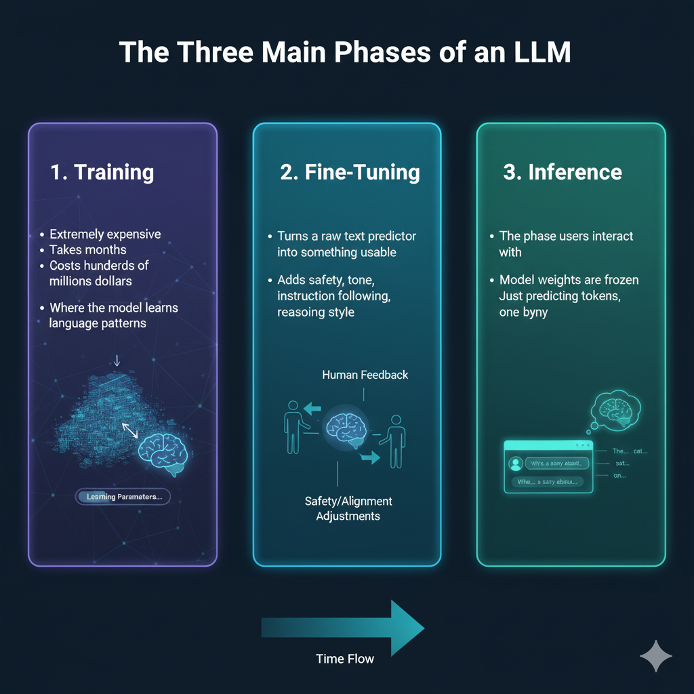
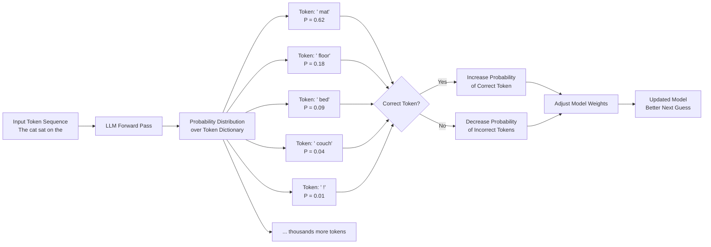

# Story Time
This talk pulls back the curtain on LLMs and shows how being aware of their mechanics helps us use them more effectively.
This is the story of an AI assistant, nicknamed Tok Guesser, it is a behind-the-scenes look at how systems like it work, complete with practical tips to help us get the most out of generative AI tools.

# 1 The Tale of Tok Guessy: Our Silicon Sidekick

This is the story of our assistant at work — Tok Guessy.

Tok is not human. It doesn’t think the way brains do. 

Tok Guessy had a studious start to it's existence. It scanned vast stretches of online text books, code, forums. It's all lossily etched deep into its circuits. Tok Guessy can know an incredible amount and still forget something you asked it just moments ago.

Tok Guessy doesn’t think in words or pictures. It thinks in numbers, and probabilities. It can display PhD-level chops in everything from physics to poetry to programming, and then stumble on something embarrassingly simple, like counting letters or doing basic arithmetic. 

Tok Guessy sounds like an expert, and so people often assume it understands like one. 

So let’s use our time together to truly understand Tok Guessy, and unlock its full potential.

# 2 Machine Learning (ML): Flipping the Problem on Its Head

To understand why Tok is brilliant one moment, baffling the next—we need to look at how it was built. Instead of explicitly instructing Tok what to do in every scenario, it learned patterns from mountains of examples. This inversion is the heart of Machine Learning, and it explains Tok behavior and quirks.


### Traditional Software

  ```javascript
  if Z:
      do X
  else:
      do Y
  ```

* Humans write explicit rules
* Software executes those rules on data
* Output is deterministic and auditable

```text
Rules + Data → Output
```

### Machine Learning

* Humans **do not** write rules
* Humans provide:

  * Data
  * Desired outputs
  * An objective
* The system **learns the rules**

```text
Data + Output → Learned Rules
```

**Key idea:**
ML systems learn patterns from data instead of following hand-written logic.

--- 

## 2. What Is an LLM?

Before we answer ^ question . . . Tok Guessy — What’s Behind the Name?
The name Tok Guessy is a description, short for “Token Guesser.” That’s all a Large Language Model really is. It breaks everything you write into tokens—chunks of words, symbols, or numbers—and then makes a guess about what token should come next.

### Machine Learning software that Learns Patterns from Text

* Large Language Models are ML models trained on massive amounts of text
* Their core task is extremely simple:

> **Given a sequence of words(tokens), predict the next word(token)**

But how does so much of Tok's capability come from something so simple?


## 2.1 Maximum sequence of words(tokens)

Tok Guessy seem sharp and consistent in short exchanges, yet lose track of earlier details in longer ones. Its limited in how much it can keep track of to generate its next tokens.

A maximum sequence of tokens the LLM can base it's next token prediction on is called the context window. 

# Sliding Window Example (Context Size = 10 Words(Tokens))

_Assume each word counts as 1 token for simplicity._

| Step | Input / Output | Context Window (10-token limit) |
|------|----------------|--------------------------------|
| 1    | User: Hello!   | [Hello!]                        |
| 2    | LLM: Hi there! | [Hello!, Hi, there!]            |
| 3    | User: How are you? | [Hello!, Hi, there!, How, are, you?] |
| 4    | LLM: I'm good, thanks! | [Hello!, Hi, there!, How, are, you?, I'm, good,, thanks!] |
| 5    | User: Tell me about black holes | Total tokens = 14 → slide oldest 4 tokens out → [are, you?, I'm, good,, thanks!, Tell, me, about, black, holes] |
| 6    | LLM: Black holes form when a star collapses | Total tokens = 20 → slide oldest 10 → [thanks!, Tell, me, about, black, holes, Black, holes, form, when] |
| 7    | User: What about Hawking radiation? | Total tokens = 27 → slide oldest 17 → [about, black, holes, Black, holes, form, when, a, star, collapses, What, about, Hawking, radiation?] |


## 3. LLMs Predict Left-to-Right (This Matters Later)

* LLMs generate text **one token at a time**
* left → right

left-to-right process explains a lot of Tok Guessy’s quirks. In math, Tok Guessy may guess an early number that sounds right, then justify it afterward.

⚠️ Keep this in mind—it will be relevant with:

* Math errors
* Why step-by-step prompting can improve LLM accuracy

---

## 4. The Three Main Phases of an LLM

This is the story of Tok Guesser’s beginnings. It's “childhood” to see how the system first learned to read and sound so natural.



### 1. Training (Building model)

This is the phase where the model is  built from scratch. It learns language by predicting the next token over and over again on enormous text datasets, slowly shaping billions of parameters into a usable model.


* Extremely expensive
* Takes months
* Costs **hundreds of millions of dollars**
* Where the model learns language patterns

### 2. Fine-Tuning (Demonstrations of correct answers)

* Turns a raw text predictor into something usable
* Adds safety, tone, instruction following, reasoning style

### 3. Inference (Usage)

* The phase users interact with

## 5. Training Phase: From Internet Text to Tokens
Tok development began here swimming through an ocean of text from across the internet, learning to guess the next token over and over until it started to see patterns in the chaos.

### Step 1: Download the Internet

Result: **A giant wall of text**
https://www.gutenberg.org/cache/epub/9109/pg9109.txt
https://www.gutenberg.org/cache/epub/77634/pg77634.txt

---

### Token Dictionary

Before Tok could start guessing, it needed to learn the alphabet of its world—breaking every word, punctuation, and number into tokens, the numerical building blocks of language.

**Notebook Companion**
[Google colab Notebook](https://colab.research.google.com/drive/15L_FmXiHN_JGUzHGCt2asj2wpxMXi44G?usp=sharing)


* Fixed vocabulary, a Map or dictionary
* Created before training
* Never changes for that model’s lifetime

| Token ID | Token        |
|---------:|--------------|
| 47       | "and"        |
| 103      | "ing"        |
| 305      | "run"        |
| 417      | "ning"       |
| 889      | "berry"      |
| 2048     | "!"          |
| 123      | "mat"        |
| 464      | "The"   |
| 924      | " cat"  |
| 1256     | " sat"  |
| 389      | " on"   |
| 262      | " the"  |

The LLMs dict represents the model’s full vocabulary, it also has special control tokens like end-of-sequence and role markers such as <system> <user> <assistant>.

## 6. Tokenization: Turning Text into Numbers

* LLMs only works with numbers/tokens/embeddings(will see this later)
* Text is split into **tokens**
* Tokens are often **subwords**, not full words

Examples:

* `"running"` → `"run"` + `"ning"`
* Tokens don’t align cleanly to words or characters

⚠️ This causes **rough edges** we’ll revisit later.

---

## 7. Token Sequences and the Training Objective

Tok first games were simple: peek at a short sequence of tokens and predict the next one—an exercise that would slowly teach it the shape of language itself.

* Tokenized text is sliced into sequences
* The **last token is hidden**
* The model must guess it

Example:

```text
"The cat sat on the" ----> mat?
```
```text 
["The", " cat", " sat", " on", " the"] -> ?
   ↓      ↓      ↓      ↓      ↓
 [  464,   924,   1256,   389,    262 ] -> [123]
```

This is **semi-supervised learning**:

* The training dataset has the correct answer
* We intentionally hide(mask) it from the model
* The model starts guessing

---

## 8. Learning Means Pattern Matching

At first, Tok guessed wildly; but with every correct prediction, its internal “mathematical brain” adjusted, slowly building an intuition for which token should come next.

* The model does a terrible job guessing at first
* The model starts **100% random**
* Over time, it improves
* It's knowledge lives in a **giant mathematical expression**



### Weights (Parameters)

* A long list of numbers
* Example:

  * GPT-3 ≈ **175 billion parameters**
  * LLaMA 7B vs 70B = number of learnable weights

More parameters → more capacity to model patterns
(Not automatically more intelligence)

---

## 9. But *How* Does Learning Actually Happen?

Underneath Tok’s guesses lie embeddings—high-dimensional vectors where similarity and meaning emerge from geometry, not understanding, shaping the way Tok “thinks.”

### Enter: Embeddings aka Vectors


* Tokens are mapped to vectors
* Vectors live in high-dimensional space
* Example:

  * LLaMA-7B uses **4096 dimensions**

At first:

* Token vectors are random

During training:

* Tokens that appear in similar contexts
* End up with **similar vectors**

Meaning emerges from geometry.

---

## 10. Vector Meaning (Why Embeddings Matter)

Tok’s internal world is a vast landscape of vectors, where words that appear in similar contexts live near each other—letting it make surprisingly human-like connections.

* Similar words → nearby vectors
* Unrelated words → far apart

Classic example:

```text
king − man + woman ≈ queen
```

This is not logic—
It’s **numerical geometry**.

---

## 11. End of Training: A Raw Next-Token/Word Guesser

By the end of training, Tok could predict tokens with skill, but it was still raw—brilliant in language structure, yet unaware of safety, tone, or social norms.

At the end of training:

* The model understands language structure
* Concepts are well represented
* But…

❌ No social skills
❌ No safety
❌ Biased, toxic, unfiltered

This is **not** ChatGPT yet.

---

## 12. Fine-Tuning: Making the Model Usable

Fine-tuning was Tok’s first lesson in manners: shaping a raw token predictor into an assistant that could safely, reliably, and helpfully interact with humans.

Fine-tuning takes a raw language model and shapes its behavior so it becomes useful, safe, and assistant-like.

### Two Main Approaches

---

### A. Supervised Fine-Tuning (SFT)

* Humans write:

  * Questions
  * Ideal answers
* Model learns to imitate

It's in JSON format: 
```json 
  {
    "instruction": "What is machine learning?",
    "response": "Machine learning is a type of software that learns patterns from data instead of relying on hand-written rules."
  },
  {
    "instruction": "Summarize the difference between traditional software and machine learning.",
    "response": "Traditional software follows explicit rules written by humans, while machine learning systems infer rules automatically from data."
  },
```

⚠️ Side effect:

* Encourages **confident answers**
* Even when wrong

This contributes to **hallucinations**.

---

### B. Reinforcement Learning from Human Feedback (RLHF)

* While SFT produces a single correct response per example
* Model is given a goal
* RLHF Makes multiple attempts
* Better attempts are rewarded
* Worse attempts are penalized

This teaches:

* Reasoning
* Deliberation
* Step-by-step problem solving

---

## 13. Reasoning vs Standard Models

Depending on fine-tuning:

* **Standard models** → fluent, fast, confident
* **Reasoning models** → slower, deliberate, step-by-step

---

## 14. Inference: What Happens When You Type a Prompt

1. Prompt → tokens
2. Tokens → embeddings
3. Embeddings → transformer layers
4. Output embeddings → tokens
5. Tokens → text

All left-to-right
One token at a time

---

## 15. Hallucinations

Sometimes Tok Guesser confidently invents answers, because predicting the next token doesn’t require it to know facts—only to sound likely, which can be both amazing and misleading.


Hallucinations happen because:

* The model **must** predict a next token
* It does **not** have a fact database
* It was trained to sound confident

So when it doesn’t know:

> It guesses what *sounds most likely*

- This is fundamental—not a bug. 
- Newer models can search the web using tools
- The model learns patterns when tool use improves results
- It calls the tool, adds results tokens to context, and continues generation
- Tool use is triggered via special tokens
- The mitigation is to prompt it to search via saying something like: "don’t guess—check"
---

## 16. Subword Tokenization Issues

Tok doesn’t see letters like humans; it sees subwords, so questions about exact characters or counts can trip it up—a quirk of how it learned to read.

Because tokens are subwords:

* The model doesn’t “see” letters
* It doesn’t “count” characters

### The Strawberry Problem

* Asking: *“How many r’s in strawberry?”*
* Fails because:

  * The word is not necessarily one token
  * Letters aren’t explicit units

---

## 17. Why Step-by-Step Reasoning Is Safer

Because Tok guesses left-to-right, guiding it with step-by-step reasoning helps prevent early missteps from snowballing, letting it turn probabilistic guesses into reliable answers.


Because prediction is left-to-right:

### ❌ Bad

```text
“What is 27 × 14?”
→ 378
```

### ✅ Good

```text
a = 27
b = 14
a × b
27 × 10 = 270
27 × 4 = 108
270 + 108 = 378
```

Intermediate steps **guide the model** and reduce error compounding.

You can prompt via "do X step-by-step" to suggest/encourage this type of 
output that leads to more likely correct answers.

Newer model have the capability to create deterministic code for calculations 
this is safer and one can make a use of this by add "use code" to the prompt.
The deterministic code logic can be inspected


Tok Guesser isn’t a thinker or a knower! Tok is a powerful tool that mimics human language so well that our brains fill in the rest. Humans are naturally wired to see human‑like traits everywhere, from faces in clouds to intention in inanimate objects. With awareness of its limits, its probabilistic guesses become an extraordinarily helpful assistants.

Use AI to support your learning, but do the thinking yourself; struggle isn’t waste, it’s growth!
