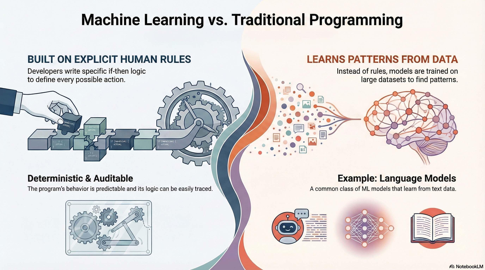
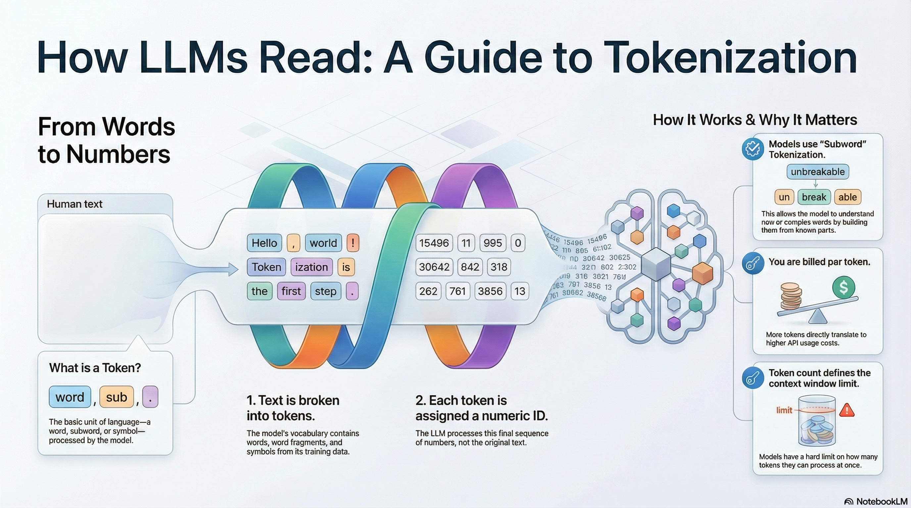
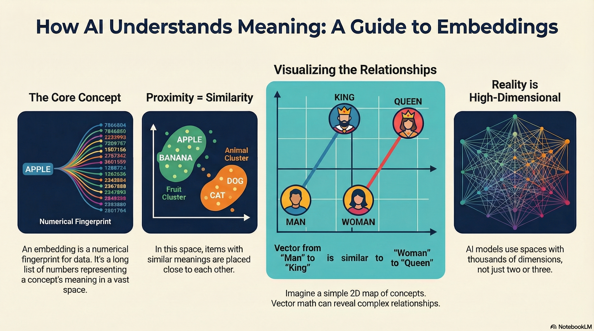
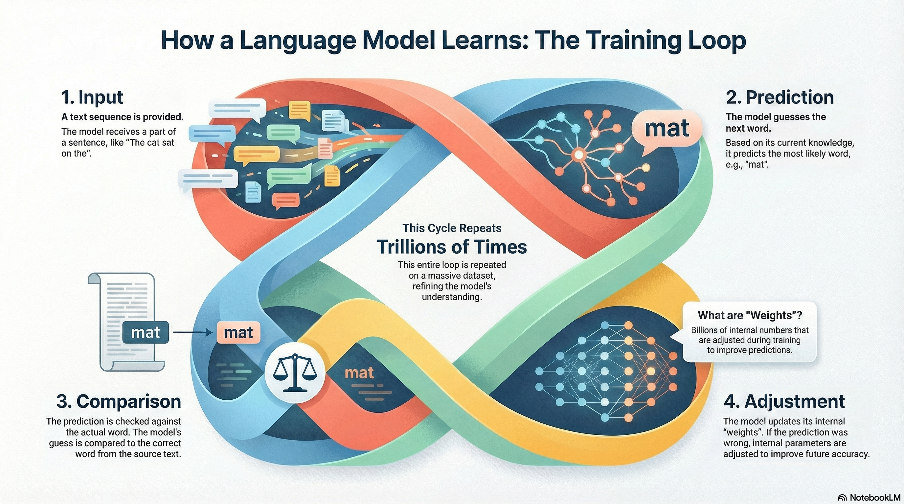
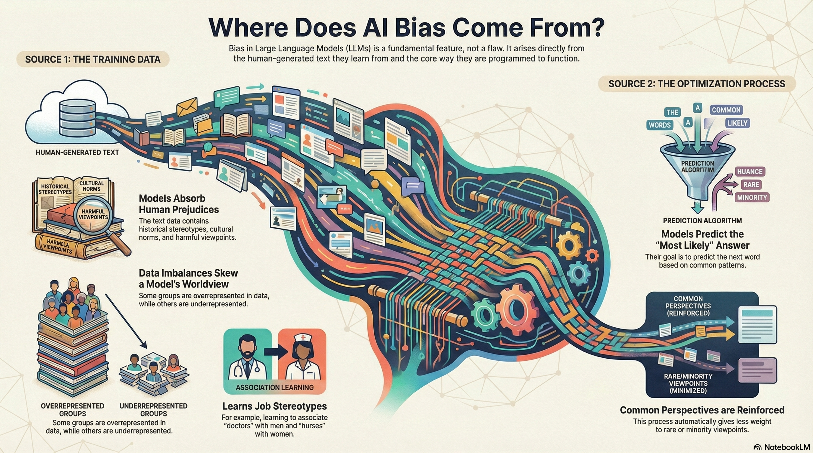
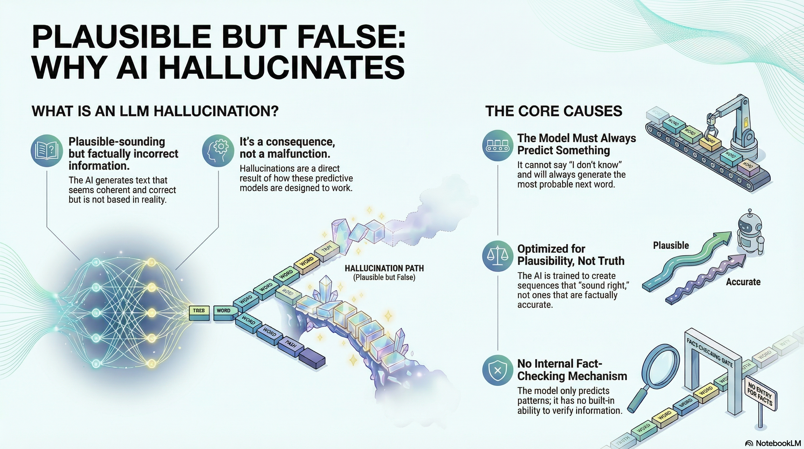
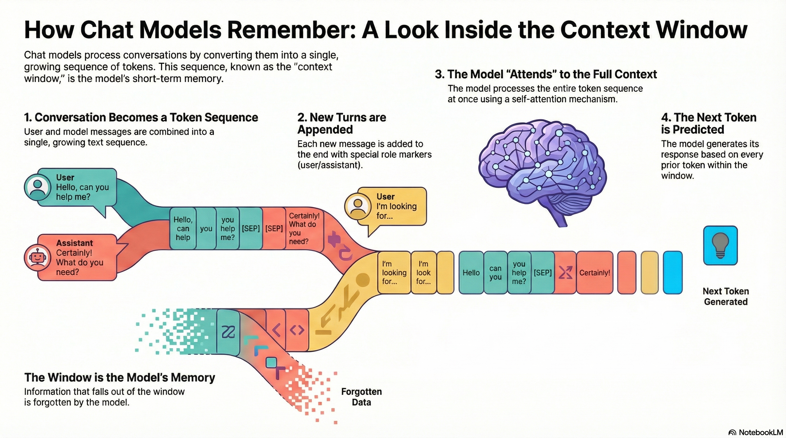

## Concepts that will help us level up

We will explore the topics below with the overarching goal of gaining a deeper understanding of the technology and becoming more competent, confident masters of it.

- **Machine Learning (ML)**
  What ML actually is, why it’s the core process behind LLMs and many AI systems, how models learn patterns from data rather than being explicitly programmed.

- **Large Language Models (LLMs)**  
  What makes a model "large," what problems these models are designed to solve, and what they fundamentally are *and are not*.

- **Transformers**  
  The core neural architecture that powers modern LLMs, why it replaced older sequential models, and how it enables massive parallelization.

- **Model Training**  
  What does it mean to train an LLM, how is it trained, the difference between pre-training and fine-tuning, and why training efficiency-not just model size-enabled modern systems to exist.

- **Bias**  
  How bias enters models through training data and optimization objectives, why it cannot be fully "removed," and how alignment and grounding mitigate-but do not eliminate-it.

- **Context Windows**  
  What a context window is, why it has a hard limit, how it affects cost and latency, and why longer conversations slow models down.

- **Hallucinations**  
  Why LLMs sometimes generate confident but incorrect information, and how this behavior follows directly from next-token prediction.

By the end of this discussion, these terms should no longer feel like opaque buzzwords. Instead, they will form a coherent mental model that explains how LLMs behave, where their limits come from, and how to use them effectively and responsibly.

## Machine Learning (ML)
Language models are a class of machine learning models. Instead of relying on hand-written rules like traditional software, they learn patterns directly from data. 

### Traditional Programming

* Humans write explicit rules:

  ```javascript
  if condition:
      do X
  else:
      do Y
  ```
* Behavior is:

  * Deterministic
  * Auditable
  * Based on logic written by humans

### Machine Learning (Including LLMs)

* Humans do **not** write rules
* Instead:

  * Provide data
  * Define an objective
  * Let the model learn statistical patterns
* Behavior is:

  * Probabilistic
  * Emergent
  * Not directly traceable to rules



Traditional software follows rules we write; machine learning systems infer patterns we don’t explicitly control.

## Large Language Models (LLMs)

LLM is a Machine Learning model trained on massive amounts of text to predict the next token, using learned patterns in language to generate and reason over text.

LLMs Are Advanced Autocomplete

At their foundation, large language models perform one task:
> **Given a sequence of tokens, predict the most likely next token.**

They are statistical machines trained to model probability distributions over language. 
Everything else: summarization, code generation, analysis-emerges from this single mechanism at scale.

## Transformers

Generative models like ChatGPT, Claude, and Gemini are all large language models (LLMs) built on an architecture called the transformer. Transformers solved several major limitations of earlier language models-most notably by processing text in parallel, which made possible scale possible. Their self-attention, allows the model to relate words across a sentence or document and correctly resolve meaning. 

Example: 
```The trophy doesn’t fit in the suitcase because it is too small.```

Self-attention helps the model correctly understand that “it” refers to the suitcase, not the trophy,

## Step 1: Tokenization - Translating Language into Numbers

**Notebook Companion**
[Google colab Notebook](https://colab.research.google.com/drive/15L_FmXiHN_JGUzHGCt2asj2wpxMXi44G?usp=sharing)



LLMs operate purely on numbers. The first step in every prompt is **tokenization**.

A **token** is the basic unit of language processed by the model. Tokens can be:

- Whole words (`hello`)
- Subwords (`run` in `running`)
- Punctuation or symbols

The model’s vocabulary is broken into tokens, covering words and word fragments from all the languages it was exposed to during training. Each token is assigned a numeric ID.

### Subword Tokenization

One token does not always align perfectly with words, below we will see why. 

Early approaches failed:

- **Word-level tokenization** caused unknown-word failures
- **Character-level tokenization** was inefficient and semantically weak

The modern solution is **subword tokenization**, typically implemented using **Byte Pair Encoding (BPE)**.

#### Byte Pair Encoding (BPE)

BPE is a compression algorithm adapted for language:

1. Start with characters as base tokens
2. Iteratively merge the most frequent adjacent character pairs
3. Continue until a fixed vocabulary size is reached

This produces an **open vocabulary**, allowing the model to represent unseen words efficiently.

### Practical Impact

- **You are billed per token**
- Token count defines the **hard context window limit**
- Jargon-heavy language often consumes more tokens
- An LLM has a fixed token vocabulary, but subword encoding lets it represent an open vocabulary by composing unseen words from known pieces.

Here’s a **clean, augmented version** of your section with an explanation of **rows vs. columns** in the embedding matrix, plus a **simple visual diagram** you can drop straight into slides or notes.

## Step 2: Embeddings - Giving Tokens Meaning

Token IDs are just numbers. Meaning comes from embeddings!

Each token is mapped to a vector, a long list of numbers-that represents its meaning. You can think of this vector as coordinates on a large map called the latent space.

These vectors are stored in a table where:

Each row corresponds to a token

Each column represents a learned feature

Tokens with similar meanings end up close together in this space (like apples and bananas), while unrelated ones (like computers) are far apart.

Although we often picture this as a 2D map, LLMs actually use hundreds or thousands of dimensions to capture meaning accurately.

### What the Embedding Matrix Represents

The embedding layer is a matrix(2D array):

```
[rows=vocabulary_size × columns=embedding_dimension]
```

#### Rows → *Tokens*

* **Each row corresponds to one token ID**
* Looking up a token means selecting its row
* Example:

  ```
  token_id = 537  →  embedding_matrix[537]
  ```

#### Columns → *Learned Features*

* Each column represents a **latent feature**
* These features are *not human-labeled*
* During training, columns come to encode things like:

  * syntactic roles
  * semantic traits
  * usage patterns
  * relational structure

A token’s **meaning is distributed across all dimensions**, not stored in any single column.

### Key Properties

* Semantically similar words are close together
* Relationships are encoded geometrically
* Vector arithmetic reflects meaning

Example:

```
king − man + woman ≈ queen
```

This is **not symbolic reasoning** - it’s numerical geometry in the learned vector space.

### Visual Intuition (Embedding Lookup)

```
                Embedding Dimensions →
           d1     d2     d3     d4   ...   d512
         ---------------------------------------
token 0 | 0.12  -0.44   0.88   1.02        ...
token 1 | -0.31  0.91   0.05  -0.77        ...
token 2 | 0.67   0.13  -0.54   0.22        ...
token 3 | ...
  ...
token 537 (king)  →  [ 0.21, -0.93, 0.44, ... ]
```

**Lookup = select a row**
**Meaning = the full vector**



When an open source model makes their weights public, part of this includes the token embedding matrix we discussed where rows are the token ids columns are the learned dimensions.


## Model Training
Large language models operate in two distinct phases: **training**, where the model learns patterns from data, and **inference**, where it applies those learned patterns to generate responses.




**Training:** the model learns its parameters by repeatedly predicting the next token on large datasets, comparing predictions to the true tokens, and updating weights via. In this phase the model is being built.

**Inference:** the trained model is frozen and used to generate outputs by repeatedly predicting the next token from the given context, without updating its weights. The model is being used by end users.

Training an LLM means teaching it to predict the next token by exposing it to massive amounts of text and adjusting its internal parameters (weights) based on prediction errors.

**What are "weights"?** An LLM contains billions of numerical parameters called weights. These include:
* The embedding matrix (token vectors we discussed earlier)
* Weights in the transformer layers (attention mechanisms, feed-forward networks)
* Output layer weights (for predicting the next token)

All of these numbers get adjusted during training to improve predictions.

### What Happens During Training

The model processes billions of text sequences. For each sequence:

1. **Input**: A sequence of tokens (e.g., "The cat sat on the")
2. **Prediction**: The model predicts the next token (e.g., "mat")
3. **Comparison**: The prediction is compared to the actual next token
4. **Adjustment**: If wrong, the model's weights are adjusted to make the correct prediction more likely next time

This process repeats trillions of times across the entire training dataset.

### The Role of Tokens and Embeddings

Training fundamentally operates on numerical representations:

* **Tokenization** converts text into token IDs
* **Embedding lookup** maps each token ID to its vector representation
* The model processes these embedding vectors through transformer layers
* **Weight updates** adjust both the transformer parameters *and* the embedding matrix itself

As training progresses, the embedding vectors learn to capture semantic meaning. Words with similar meanings naturally cluster together in the embedding space because they appear in similar contexts.

## Bias

Bias in LLMs is not a bug to be fixed-it's an inherent consequence of learning from human-generated data. Understanding where bias comes from helps us use these models more responsibly.



### Where Bias Enters the Model

**Training Data Reflects Human Bias**

LLMs learn from text written by humans, which contains:
* Historical prejudices and stereotypes
* Cultural assumptions and norms
* Representation imbalances (some groups are overrepresented, others underrepresented)
* Controversial or harmful viewpoints that exist in public discourse

If the training data contains patterns like "doctors are men" or "nurses are women," the model will learn and reproduce these associations.

**Optimization Objectives Create Bias**

The model is trained to predict the *most likely* next token based on patterns in its training data. This means:
* Common patterns are reinforced
* Rare perspectives are underweighted
* The model favors "typical" responses over diverse ones

### Why Bias Cannot Be Fully "Removed"

**Language Itself Encodes Bias**

Bias is woven into the fabric of language:
* Word associations reflect societal patterns
* Context determines meaning, and context carries cultural assumptions
* "Neutral" language is often impossible-word choice always carries connotations

**The Prediction Objective Requires Patterns**

To predict the next token, the model *must* learn statistical patterns from its training data. You cannot separate "good patterns" (grammar, facts) from "bad patterns" (stereotypes) without fundamentally changing how the model works.

**Be Aware of Bias in Outputs**
* LLMs may generate stereotypical associations
* Default responses may reflect majority perspectives
* Historical biases may appear in generated content

**Use Prompting to Mitigate**
* Request diverse perspectives explicitly
* Ask for balanced viewpoints
* Specify the context and audience
* Challenge assumptions in follow-up prompts

**Understand the Limitations**
* No LLM is "unbiased"-all reflect their training data
* Alignment reduces harmful outputs but doesn't eliminate underlying patterns
* Critical evaluation of outputs is always necessary

Bias is a feature of learning from human data, not a temporary flaw. Effective use requires awareness, not assumption of neutrality.

## Hallucinations

Hallucinations occur when an LLM generates plausible-sounding but factually incorrect information. This isn't a malfunction-it's a direct consequence of how these models work.




### Why Hallucinations Happen

**The Model Must Always Predict Something**

Given a prompt, the LLM *must* generate a next token. It cannot say "I don't know" unless it has learned that as a valid response pattern. When uncertain, it still produces the most probable token based on patterns, even if that token is factually wrong.

**Plausibility ≠ Accuracy**

The model is trained to generate *likely* sequences, not *true* sequences:
* It learns what "sounds right" based on training data patterns
* Grammatically correct and contextually coherent text can be completely false
* The model has no mechanism to verify facts-it only predicts tokens

**Pattern Completion Over Fact Retrieval**

LLMs don't "look up" information-they complete patterns:
* If the prompt resembles patterns in training data, the model continues that pattern
* If the prompt is novel or ambiguous, the model fills gaps with plausible-sounding content
* The model cannot distinguish between "I learned this fact" and "this sounds like something I learned"

### Common Hallucination Scenarios

**Fabricated Details**

When asked for specific information (dates, names, statistics), the model may:
* Generate plausible but incorrect numbers
* Invent citations or sources
* Create realistic-sounding but false details

### Why This Is Fundamental, Not Fixable
LLMs are trained to minimize prediction error on their training data, not to maximize factual accuracy. The training objective is:

> "Given this context, what token comes next?"

Not:

> "Given this context, what is the true answer?"


### Mitigation Strategies

**Grounding with External Information**

Provide factual context in your prompt:
* Include relevant documents or data
* Cite specific sources
* Give the model concrete information to work from

**Retrieval-Augmented Generation (RAG)**

Systems that combine LLMs with search:
* Retrieve relevant documents first
* Provide them as context to the model
* Ground responses in retrieved information

**Verification and Cross-Checking**

* Treat LLM outputs as drafts, not facts
* Verify important claims independently
* Use multiple sources for critical information
* Be especially skeptical of specific details (dates, numbers, citations)

**Prompt for Uncertainty**

* Ask the model to express confidence levels
* Request caveats and limitations
* Encourage "I don't know" responses when appropriate

### Practical Implications

**Use Cases Matter**

* Creative writing: Hallucinations may be acceptable or even desirable
* Factual research: Hallucinations are dangerous-verification is essential
* Code generation: Hallucinations can create subtle bugs

**Trust but Verify**

* LLMs are powerful tools for drafting, brainstorming, and exploration
* They are not reliable sources of truth without verification
* The more critical the application, the more verification is needed

Hallucinations are not a temporary limitation-they are a fundamental consequence of next-token prediction. Understanding this helps you use LLMs effectively within their actual capabilities.

## Context Window

In a chat conversation, each user message and each model response is serialized into a single growing sequence of tokens. Every new turn is appended to the end of this sequence, along with special tokens or markers that indicate roles (user, assistant, system). When the model generates the next token, it takes the entire current token sequence within the context window, converts it into embeddings, and runs self-attention across all of those tokens at once. 



The probability distribution for the next token is computed conditioned on every prior token still in the window, which is why earlier parts of the conversation can influence tone, facts, and constraints-until they fall out of the context window and are no longer included in the attention computation.

## Bias
<iframe width="560" height="315" src="https://www.youtube.com/embed/OhCzX0iLnOc?si=vdqgKJmBWxKH6C89" title="YouTube video player" frameborder="0" allow="accelerometer; autoplay; clipboard-write; encrypted-media; gyroscope; picture-in-picture; web-share" referrerpolicy="strict-origin-when-cross-origin" allowfullscreen></iframe>

<iframe width="560" height="315" src="https://www.youtube.com/embed/59bMh59JQDo?si=STX4ELtrYCFNTNqm" title="YouTube video player" frameborder="0" allow="accelerometer; autoplay; clipboard-write; encrypted-media; gyroscope; picture-in-picture; web-share" referrerpolicy="strict-origin-when-cross-origin" allowfullscreen></iframe>

## Tokenization 
<iframe width="560" height="315" src="https://www.youtube.com/embed/byajUNOOqNI?si=E8u7Mut05ydY38Gx" title="YouTube video player" frameborder="0" allow="accelerometer; autoplay; clipboard-write; encrypted-media; gyroscope; picture-in-picture; web-share" referrerpolicy="strict-origin-when-cross-origin" allowfullscreen></iframe>

[BPE vocabulary builder demo](https://www.bpe-visualizer.com/)

## Token Vectors aka Token Embeddings
<iframe width="560" height="315" src="https://www.youtube.com/embed/0TiJ9c9rzZA?si=0zSv1PavXfLn9pjs" title="YouTube video player" frameborder="0" allow="accelerometer; autoplay; clipboard-write; encrypted-media; gyroscope; picture-in-picture; web-share" referrerpolicy="strict-origin-when-cross-origin" allowfullscreen></iframe>

<iframe width="560" height="315" src="https://www.youtube.com/embed/ISPId9Lhc1g?si=bkpfo6bIvvVB0xf8" title="YouTube video player" frameborder="0" allow="accelerometer; autoplay; clipboard-write; encrypted-media; gyroscope; picture-in-picture; web-share" referrerpolicy="strict-origin-when-cross-origin" allowfullscreen></iframe>

## Context Window
<iframe width="560" height="315" src="https://www.youtube.com/embed/Z0GWWTHpcik?si=T4_9-Y3vIynxeVWL" title="YouTube video player" frameborder="0" allow="accelerometer; autoplay; clipboard-write; encrypted-media; gyroscope; picture-in-picture; web-share" referrerpolicy="strict-origin-when-cross-origin" allowfullscreen></iframe>